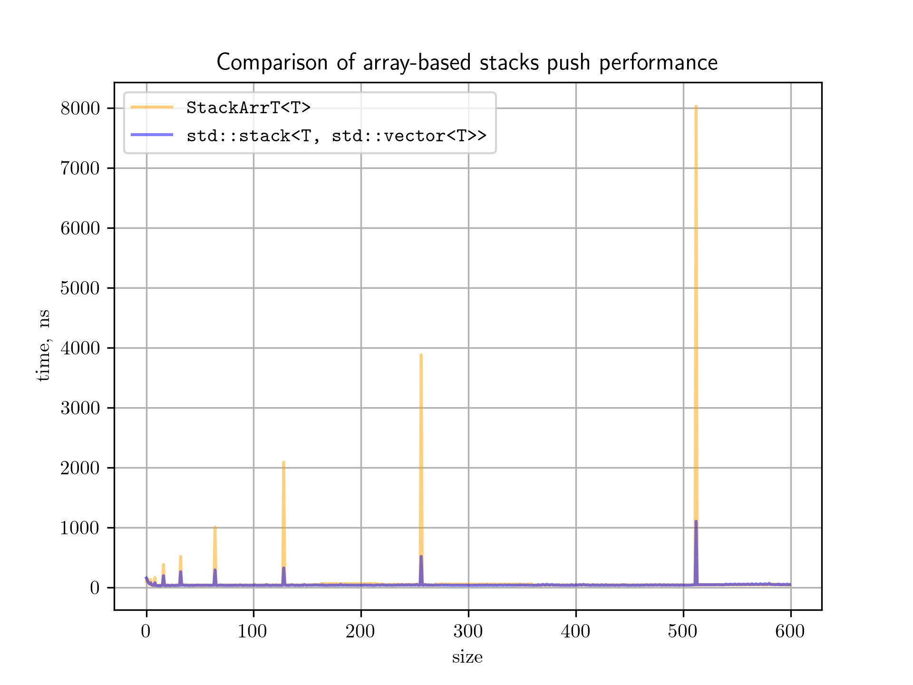
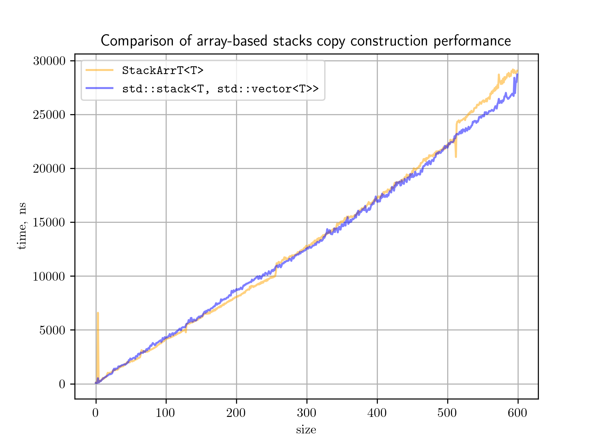
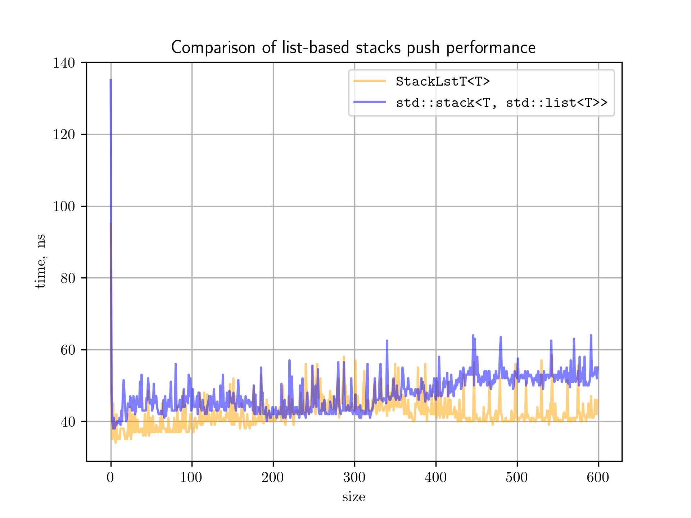
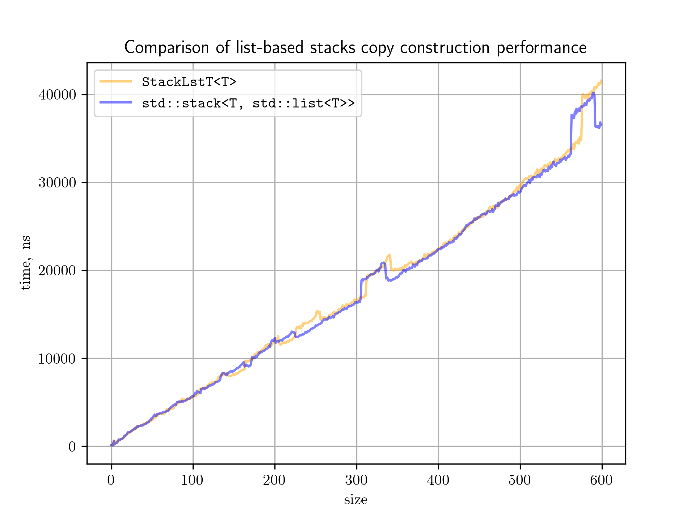

# Task 1: Stack

## Описание решения

По условию, необходимо реализовать структуру данных _стек_. Для этого решения образцом функциональности послужил `std::stack`. Сам стек для возможности повторного использования собирается как статичная библиотека. Реализованы тесты для проверки корректности работы стеков.

Приложен также и алгоритм получения данных и построения графиков `collect_data.py`. Для скрипта не требуется предварительная сборка, в скрипт встроены соответствующие команды. Команда для запуска скрипта:

```bash
    python3 collect_data.py [number_of_runs] [maximum_size]
```

## Анализ алгоритмов

Общая функциональность стеков такова:

- `empty`
- `size`
- `top`
- `push`
- `pop`
- `constructor(const Stack<T>&)` - конструктор копирования
- `constructor(Stack<T>&&)` - конструктор перемещения
- `operator=(const Stack<T>&)` - копирующее присваивание
- `operator=(Stack<T>&&)` - перемещающее присваивание

Очевидно, не имеет смысла анализировать `empty`, `size`, `top` и `pop` и перемещающие версии конструктора и присваивания, поскольку все они имеют временную асимптотику $\Theta(1)$, так их реализация не зависит от длины хранимых данных. Из-за больших объемов данных для тестирования при их замере общее падение производительности из-за работы в одном потоке и количества используемой памяти существенно превзойдет, как тренд, асимптотику самих операций. Остальные же функции имеет смысл анализировать. В качестве хранимого типа будем использовать строки, поскольку размер строки легко отрегулировать так, чтобы получить измеримое значение времени выполнения операций.

### `ArrayStack` - реализация на массиве

- `push`

Для массива лучшая временная асимптотическая верхняя оценка от количества элементов $\mathrm{O}(n)$, поскольку будут находиться моменты, в которые придется увеличивать вместимость массива, копируя при этом его содержимое за линейное время. Лучшая оценка снизу, соответственно, $\Omega(1)$, так как при добавлении без копирования время зависит только от затрат на копирование соответствующего элемента, но не от их количества в стеке.

<p align="center">
  
</p>

Построен график двух случаев, как показано в легенде. Прямое использование стека на массиве и `STL` реализация.

Оказывается, политика расширения `std::vector` совпадает с выбранной мной, поэтому вид графиков идентичен. Однако, мой алгоритм использует move-семантику для перемещения объектов при расширении массива, что менее эффективно, чем подход `std::vector`, который использует прямое копирование памяти.

В остальном, теоретический прогноз сходится с реальностью.


- `constructor(const Stack<T>&)`

Лучшая оценка для копирующего конструктора $\Theta(n)$ от количества элементов, поскольку необходимо каждый раз производить поэлементное копирование массива.

<p align="center">
  
</p>

График подтверждает теоретическую зависимость с точностью до ступенчатого роста графика времени на точках $2^n$, поскольку на выделение большего объема памяти начинает тратиться больше времени, а расширение происходит каждый раз вдвое. Доминирующий линейный тренд связан с затратами на копирование.

Как видно, по производительности кастомная реализация стека практически не отличается от реализации `STL`.

Пик при малых длинах тут наблюдается у обеих вариантов реализации, поэтому его можно связать с нюансами, которые не зависят от написанного алгоритма.

### `ListStack` - реализация на односвязном списке

- `push`

Лучшая теоретическая асимптотика для вставки $\Theta(1)$, поскольку образование ноды и копирование в нее элемента не зависят от длины стека.

<p align="center">
  
</p>

Как видно из графика, теоретическая оценка на константное время подтверждается на практике. Также вновь кастомная реализация на одном уровне с `STL`.

- `constructor(const Stack<T>&)`

Лучшая теоретическая асимптотика для копирования $\Theta(n)$, поскольку необходимо выполнить образование ноды и копирование в нее элемента не ровно столько раз, сколько элементов в массиве.

<p align="center">
  
</p>

Как видно из графика, зависимость с хорошей точностью линейна. Отличие от реализации `STL` практически незаметно. Аномалии графика совпадают между кастомными реализациями и `STL`.

## Вывод
- Построены достаточно эффективные в сравнении со стандартной библиотекой алгоритмы
- Теоретическая оценка решений совпадает с практическим замером
- Аномалии замера совпадают между `STL` и кастомной реализацией алгоритмов, потому не зависят от реализации
