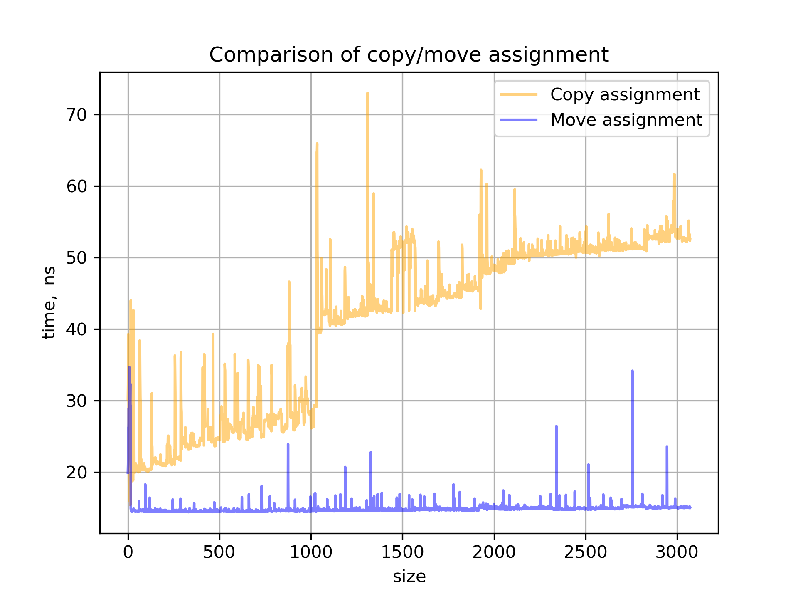

# Task 4: String profiling

## Описание решения

По условию, необходимо профилировать move-семантику `std::string`. Фактические замеряемые функции оборачиваются в лямбда-функцию, которая профилируется шаблонной функцией-профайлером. Подход может повлиять на результат замера, но не более чем на некоторую $\mathrm{O}(1)$ задержку.

Приложен также и алгоритм получения данных и построения графиков `collect_data.py`. Для скрипта не требуется предварительная сборка, в скрипт встроены соответствующие команды. Команда для запуска скрипта:

```bash
    python3 collect_data.py [number_of_runs] [maximum_size]
```

## Анализ решения

Заранее можно сказать, что ожидается следующее поведение:
- Перемещающие операции должны быть не дороже копирующих;
- Время перемещающих операций должно быть близко к постоянному;
- Время копирующих операций должно возрастать с ростом числа элементов.

### `Construction` - конструкторы

Рассмотрим полученный график:

<div align="center">
    
</div>

Можно заметить, что все три изначальных прогноза подтвердились, но с некоторыми особенностями.

Во-первых, на малых строках наблюдается, что копирующие и присваивающие конструкторы работают с одинаковой производительностью - полное копирование.

Во-вторых, график перемещающей версии ступенчатый; на тех же местах скачком меняется скорость копирующей версии. По всей видимости, память на строку выделяется блоками сразу по 1 Кб (1024 символа).

Также, для копирующего конструктора наблюдается необычная форма графика: гладко нисходящие участки.

### `Assignment` - конструкторы

Рассмотрим полученный график:

<div align="center">
    
</div>

Справедливы те же наблюдения, что и для конструкторов, кроме наблюдения про форму графика копирующего конструктора. При копирующем присваивании наблюдаются не исходящие гладкие кривые, а скачки, образующие на графике плато.

## Выводы
- Можно заметить, что память на строки выделяется сразу большими блоками
- Присутствует оптимизация малых строк, когда вместо перемещения всего участка памяти целиком копируется лишь начальная часть
- Также есть особенности реализации операций, которые влияют на график, но которые пока не получается объяснить
