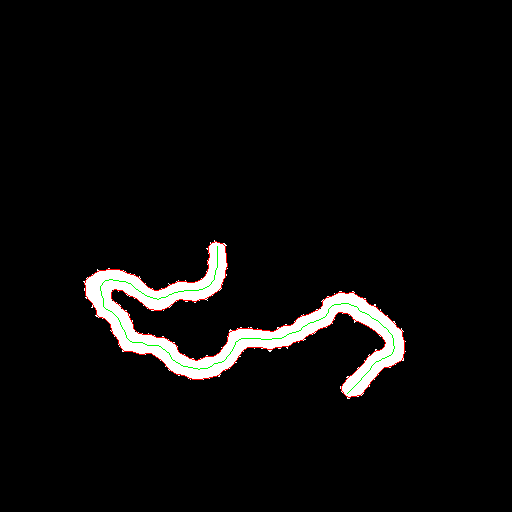
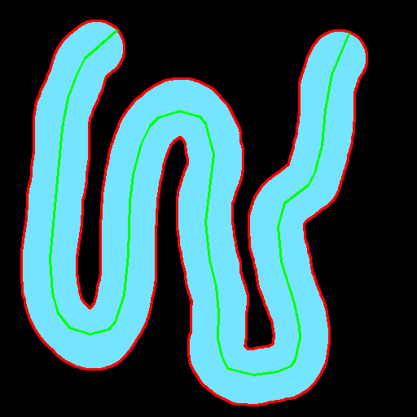
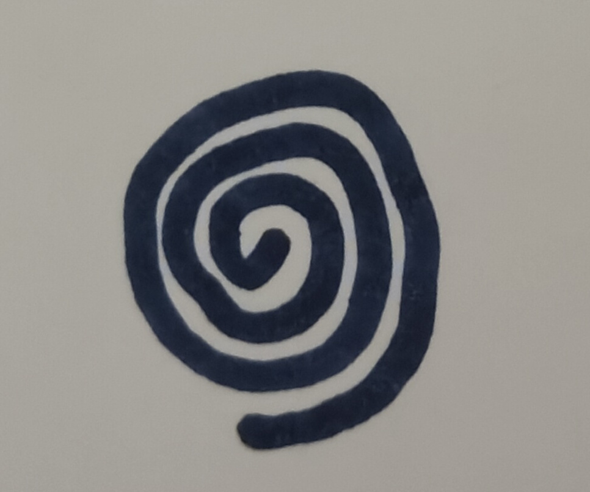

# Individual task
Протяженные 2d объекты: для маски нахождение осевой линии и сглаживание контура

## Описание задачи

**Входные данные:** `.png` изображение с маской - замкнутый протяженный контур.

**Выходные данные:** в одном из доступных форматов векторной графики вывести сглаженную версию контура и осевую линию.

## Генератор

Реализована алгоритмическая генерация данных, результатом которой является протяженная фигура с зашумленным контуром.
Пример сгенерированных изображений можно найти ниже в секции про само приложение.

### Описание

В алгоритме реализован метод случайных блужданий с коррекцией траектории. Опишем шаги работы алгоритма:
1) Выбирается начальная точка
2) Строится абсолютно случайно первый шаг
3) Рассчитывается центростремительная сила (tension), сила отталкивания от предыдущих вершин (repel) и вклад предыдущего направления (momentum). Производится взвешенное усреднение для выбора ориентации следующего шага
4) Случайно выбирается направление следующего шага в конусе видимости вокруг выбранного в пункте 3 направления
5) Повторяются шаги 3-4, пока не будет отрисовано требуемое количество шагов
6) Определяется контур полученной фигуры и каждая его точка случайно смещается на небольшой сдвиг
7) Отрисовывается контур из пункта 6
8) Сохраняется сгенерированное изображение

### Конфигурация

Приведем пример блока генератора в файле конфигурации и опишем значение переменных:

```toml
[generator]
# Ширина кисти при отрисовке фигуры в пунктах 1-5
strokeWidth = 80
# Длина одного звена фигуры в пунктах 1-5
step = 80.0
# Полураствор конуса видимости из пункта 4 в долях числа пи
fov = 0.125
# Ограничение на положение точки из пункта 1 в долях размера изображения
initialBound = 0.25
# Вес моментума для пункта 3
momentumFactor = 0.8
# Вес центростремительной силы для пункта 3
tensionFactor = 0.8
# Вес силы отталкивания для пункта 3
repelFactor = 1.0
# Размер рандомизации для пункта 6 в долях strokeWidth
imperfectionFactor = 0.1
```

### Запуск

Приведем сигнатуру команды запуска генератора:
```bash
./gen width height segmentNum destName
```

Где:
- `width`, `height` - ширина и высота изображения в пикселях
- `segmentNum` - число сегментов фигуры
- `destName` - имя выходного файла

#### Release
Уровень логгирования ограничен `INFO` сообщениями, не сохраняются отладочные изображения.

#### Debug
Уровень логгинга ограничен `DEBUG` сообщениями, сохраняются отладочные изображения.


## Приложение

Реализовано приложение по сглаживанию контура протяженной фигуры и отрисовке средней линии.
Приведем сразу примеры работы алгоритма на сгенерированных упомянутым ранее генератором изображениях.
Показаны пары до и после обработки с разрешениями 128x128, 256x256, 512x512, 1024x1024.


### Описание

Распишем работу обработчика пошагово:
1) Усредняющее сглаживание (medianBlur), оно показало оптимальные по качеству результаты с точки зрения отброса дефектов при сохранении контура
2) Детектирование полученного сглаженного контура
3) Дополнение исходной фигуры по внутренности контура
4) Скелетонизация изображения алгоритмом Чанг-Суэна (Zhang-Suen)
5) Детектирование контура на скелетонизированном изображении для нахождения средней линии
6) Нахождение концов контура и обрезка по ним, чтобы оставить незамкнутую ломаную
7) Пересэмплирование ломаной
8) Интерполяция ломаной до границ контура прямым продолжением
8) Отрисовка сглаженного контура и средней линии
9) Сохранение результата обработки

### Основные методы

Методы детектирования вынесены в отдельный файл `detect.hpp`. Приведем сигнатуры методов с описанием:

```cpp
// Метод детектирования сглаженного контура протяженной фигуры

/**
 * Detect smoothed contour of an elongated shape
 * 
 * @param src Source image
 * @return Detected contours
 */
std::vector<std::vector<cv::Point>> detectSmoothedContour(const cv::Mat& src);
```

```cpp
// Метод детектирования средней линии протяженной фигуры

/**
 * Detect median line of an elongated shape
 * 
 * @param src Source image
 * @param contours Contour[0] is used as a shape border
 * @return Detected median line
 */
std::vector<cv::Point> detectMedian(const cv::Mat& src, const std::vector<std::vector<cv::Point>> contours)
```

### Конфигурация

Приведем пример блока приложения в файле конфигурации и опишем значение переменных:

```toml
[main]
# Ширина кисти для пункта 6
strokeWidth = 1
# Размер ядра сглаживания для пункта 1
kernelSize = 9
```

### Запуск

Приведем сигнатуру команды запуска приложения:
```bash
./main srcName
```

Где:
- `srcName` - имя выходного файла

#### Release
Уровень логгирования ограничен `INFO` сообщениями, не сохраняются отладочные изображения.

#### Debug
Уровень логгинга ограничен `DEBUG` сообщениями, сохраняются отладочные изображения.

### Исследование работы алгоритма

#### Более суровая генерация

Были подобраны значения гиперпараметров генератора таким образом, чтобы генерация данных была более агрессивной. Имеется в виду повышение вероятности (и количества) ситуаций почти самопересечения фигуры. Приведем результаты:





Приведены данные по разным размерам изображения. Видно, что он достаточно хорошо справляется со своей задачей на типичном виде данных генератора.

#### Нарисованные вручную фигуры

Для того, чтобы проверить работу при разных фонах и разных цветах фигуры были вручную в `gimp` нарисованы несколько изображений.




Как видно, и тут алгоритм справляется с задачей. Стоит отметить, что алгоритм работает проблемно на слишком маленьких расстояниях сближения (~1 пикселя).

#### Реальные данные

Наиболее интересно посмотреть, как отработает алгоритм на реальной фотографии фигуры на бумаге. И такое тоже было проверено:





И в этом случае алгоритм удачно и верно срабатывает.

#### Потенциально сложные для приложения случаи

Перечислим потенциально сложные для детектора случаи:
- Очень узкие фигуры
- Слабо протяженные фигуры
- Слишком близкие почти самокасания (~1 пикселя) или самокасания
- Слишком низкая контрастность изображения из-за использования thresholding в детекции фигуры

Начнем с очень узких фигур:


Как видно, даже протяженная фигурка толщиной в 1 пиксель создается нормально распознается и отрисовываются как границы, так и средняя линия. (Для корректного распознавания необходимо снижать размер ядра `kernelSize`)

Теперь перейдем к слабо протяженным фигурам:


Даже слабо протяженные фигуры обрабатываются алгоритмом без проблем. Однако совершенно не протяженная фигура (как круг на картинке выше) стягиваются в точку алгоритмом thinning, программа это осознает и выдает зарезервированную ошибку `AppException` о том, что нельзя определить начало и конец средней линии (их нет в данном случае).

Проговорим про (почти) самокасания:


Как видно, если есть зазоры хотя бы в 1 пиксель, то алгоритм отрабатывает корректно. В случае же полного касания невозможно при текущем подходе отделить контуры и алгоритм терпит неудачу.

#### Итог

Алгоритм успешно работает на разнообразных входных данных. Однако можно отметить несколько ограничений:
- Непротяженность фигур (не предполагается таких данных по условию)
- Самокасания
- Слишком низкая контрастность изображения из-за использования thresholding в детекции фигуры
