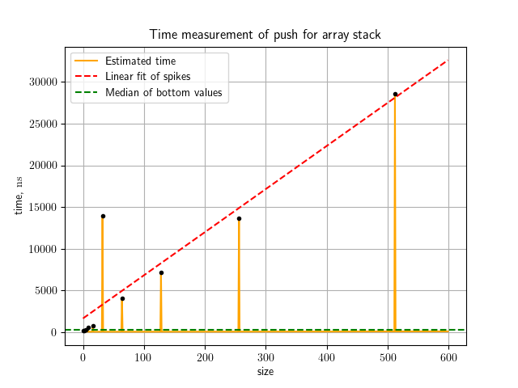
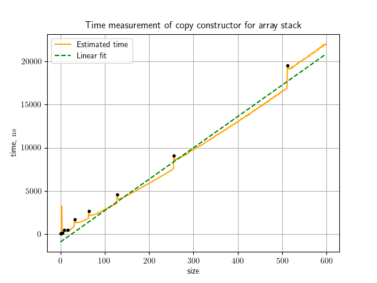
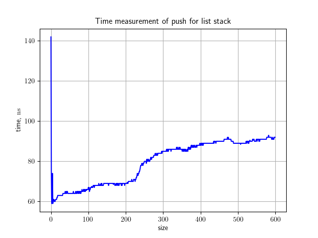

# Task 1: 01.01.2024-07.02.2024

## Описание решения

По условию, необходимо реализовать структуру данных _стек_. Для этого решения образцом функциональности послужил `std::stack`. Сам стек для возможности повторного использования собирается как статичная библиотека. Реализованы тесты для проверки корректности работы стеков. Используется тестовый фреймворк GoogleTest, скачиваемый при необходимости через FetchContent, потому лишних установок не требуется. В проекте задана условная компиляция. В профиле `Debug` работает clang-tidy и исполняются тесты, но в профиле `Release` выполняется лишь чистая компиляция проекта.

Для удобства, используемые команды сборки:

```bash
    cmake -DCMAKE_BUILD_TYPE=Debug -B build . && cmake --build build 
```

```bash
    cmake -DCMAKE_BUILD_TYPE=Release -B build . && cmake --build build 
```

Приложен также и алгоритм получения данных и построения графиков `collect_data.py`. Команда для запуска:

```bash
    python3 collect_data.py [number_of_runs] [maximum_size]
```

## Анализ алгоритмов

Общая функциональность стеков такова:

- `empty`
- `size`
- `top`
- `push`
- `pop`
- `constructor(const Stack<T>&)` - конструктор копирования
- `constructor(Stack<T>&&)` - конструктор перемещения
- `operator=(const Stack<T>&)` - копирующее присваивание
- `operator=(Stack<T>&&)` - перемещающее присваивание

Очевидно, не имеет смысла анализировать `empty`, `size`, `top` и `pop` и перемещающие версии конструктора и присваивания, поскольку все они имеют временную ассимптотику $\Theta(1)$, так их реализация не зависит от длины хранимых данных. Из-за больших объемов данных для тестирования при их замере общее падение производительности из-за работы в одном потоке и количества используемой памяти существенно превзойдет, как тренд, ассимптотику самих операций. Остальные же функции имеет смысл анализировать. В качестве хранимого типа будем использовать строки, поскольку размер строки легко отрегулировать так, чтобы получить измеримое значение времени выполнения операций.

### `ArrayStack` - реализация на массиве

- `push`

Для массива лучшая временная асимптотическая верхняя оценка от количества элементов $\mathrm{O}(n)$, поскольку будут находиться моменты, в которые придется увеличивать вместимость массива, копируя при этом его содержимое за линейное время. Лучшая оценка снизу, соответственно, $\Omega(1)$, так как при добавлении без копирования время зависит только от затрат на копирование соответствующего элемента, но не от их количества в стеке.

<p align="center">
  
</p>

Полученный график подтверждает справедливость оценок с точностью до случайного разброса. График оценки сверху построен как линейная аппроксимация пиков, вызванных копированием; график нижней оценки как медиана по непиковым значениям.

__По какой-то причине без изменений исходного кода проявился один высокий пик, хотя до этого асимптотика была такой, как описано выше. Это объяснить не получается. Повторные замеры также ничего не меняют__


- `constructor(const Stack<T>&)`

Лучшая оценка для копирующего конструктора $\Theta(n)$ от количества элементов, поскольку необходимо каждый раз производить поэлементное копирование массива.

<p align="center">
  
</p>

График подтверждает теоретическую зависимость с точностью до ступенчатого роста графика времени на точках $2^n$, поскольку на выделение большего объема памяти начинает тратиться больше времени, а расширение происходит каждый раз вдвое. Доминирующий тренд все равно связан именно с затратами на копирование и выделен зеленым как линейная аппроксимация.

__Странный высокий пик наблюдается и здесь__

### `ListStack` - реализация на односвязном списке

- `push`

Лучшая теоретическая асимптотика для вставки $\Theta(1)$, поскольку образование ноды и копирование в нее элемента не зависят от длины стэка.

<p align="center">
  
</p>

Как видно из графика, большой размер стека косвенно влияет на производительность, но это не некоторая выделенная зависимость, а величина порядка скорости копирования примитивов.

__Одновременно с появлениями странностей на первых графиках на этом появились "холмы" в средней части и начальный пик__

- `constructor(const Stack<T>&)`

Лучшая теоретическая асимптотика для вставки $\Theta(n)$, поскольку ytj,необходимо выполнить образование ноды и копирование в нее элемента не ровно столько раз, сколько элементов в массиве.

<p align="center">
  
</p>

Как видно из графика, зависимость с высокой точностью линейна.

__Одновременно с появлениями странностей на первых графиках на этом появились странные бугры, зависимость теперь выглядит линейной только в общем__